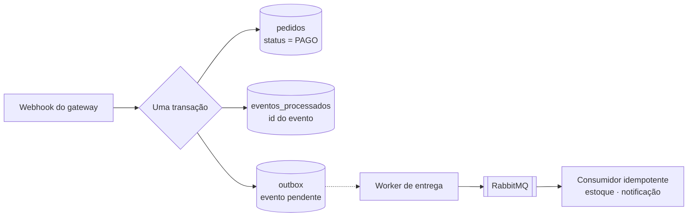

# API de Pedidos e Pagamentos

API REST de pedidos com pagamento por gateway externo, construída em Java 21 com Spring Boot 4, PostgreSQL e RabbitMQ.

O que este projeto resolve não é o CRUD de produtos — é o que acontece quando a aplicação **depende de outro sistema**: o webhook do gateway que chega duas vezes, e a gravação no banco que precisa acontecer junto com a publicação na fila sem que exista transação entre os dois.

## No ar

**<https://api-pedidos.onrender.com>**

[Demonstração ao vivo](https://api-pedidos.onrender.com) · [Swagger UI](https://api-pedidos.onrender.com/swagger-ui.html) · [Health](https://api-pedidos.onrender.com/actuator/health) · [Catálogo](https://api-pedidos.onrender.com/api/produtos)

A raiz traz uma página que executa a demonstração da idempotência **ao vivo**: ela cria uma conta, monta um pedido e reenvia **a mesma requisição com a mesma `Idempotency-Key`**, mostrando `201` na primeira e `200` na segunda — com o mesmo pedido e o estoque saindo uma vez só. É o argumento central do projeto rodando no navegador, sem precisar de terminal.

O serviço roda no plano gratuito do Render e hiberna quando ocioso — a primeira requisição depois de um tempo parado pode levar alguns segundos.

---

## Sumário

- [No ar](#no-ar)
- [Os dois problemas centrais](#os-dois-problemas-centrais)
  - [Problema 1 — O webhook que chega duas vezes](#problema-1--o-webhook-que-chega-duas-vezes)
  - [Problema 2 — Gravar no banco e publicar na fila](#problema-2--gravar-no-banco-e-publicar-na-fila)
- [Decisões técnicas](#decisões-técnicas)
- [Modelo de domínio](#modelo-de-domínio)
- [Regras de negócio](#regras-de-negócio)
- [API](#api)
- [Como rodar](#como-rodar)
- [Testes](#testes)
- [Stack](#stack)
- [Roadmap](#roadmap)

---

## Os dois problemas centrais

### Problema 1 — O webhook que chega duas vezes

Quando um pagamento é aprovado, o gateway avisa a aplicação por webhook. Essa notificação **vai chegar mais de uma vez** — não é falha, é como gateways funcionam. A entrega é "pelo menos uma vez": se a resposta demora, se volta um 500, se a conexão cai depois do processamento mas antes da confirmação, o mesmo evento é reenviado.

A tentação é escrever isto:

```java
Pedido pedido = repositorio.buscar(evento.pedidoId());
pedido.marcarComoPago();          // <-- errado
estoque.baixar(pedido.itens());
email.enviarConfirmacao(pedido);
```

Na segunda entrega do mesmo evento, o estoque é baixado de novo e o cliente recebe o e-mail de novo.

A solução é registrar o identificador único do evento numa tabela com restrição de unicidade, **dentro da mesma transação** que aplica o efeito:

```
BEGIN
  INSERT INTO eventos_processados (id_externo) VALUES (?)   -- colide na segunda vez
  ... aplica o efeito ...
COMMIT
```

Ou as duas coisas acontecem, ou nenhuma. A segunda entrega colide na restrição, a transação inteira é desfeita e o evento é descartado com segurança — respondendo 200 para o gateway parar de reenviar.

O mesmo raciocínio vale na entrada da API: a criação de pedido aceita um cabeçalho `Idempotency-Key`, para que o cliente possa reenviar a requisição depois de um timeout sem criar dois pedidos.

### Problema 2 — Gravar no banco e publicar na fila

Confirmado o pagamento, a aplicação precisa fazer duas coisas: gravar a mudança no PostgreSQL e publicar um evento no RabbitMQ para que o estoque seja baixado e o cliente notificado.

São dois sistemas diferentes, e eles **não compartilham transação**. Qualquer ordem falha:

| Ordem | Falha possível | Resultado |
|---|---|---|
| Publicar, depois commitar | o commit falha | evento publicado sobre algo que não aconteceu |
| Commitar, depois publicar | a publicação falha | pedido pago e ninguém avisado |

A saída é o **padrão outbox**: a aplicação não publica na fila. Ela grava o evento numa tabela `outbox` na mesma transação que altera o pedido — uma transação, um banco, atômica. Um worker separado lê a tabela e publica, marcando o que já entregou.



Repare no que o outbox **não** promete: entrega exatamente uma vez. Se o worker publica e morre antes de marcar a linha como entregue, ele publica de novo na próxima rodada. O padrão troca "exatamente uma vez" — impossível entre sistemas que não compartilham transação — por "**pelo menos uma vez, com consumidor idempotente**".

É por isso que os dois problemas deste projeto são o mesmo problema visto de dois lados: o outbox só é seguro porque o outro lado sabe ignorar repetição.

Cada comportamento tem um teste que o comprova:

| Teste | O que prova |
|---|---|
| `WebhookIT.mesmoEventoDuasVezes` | três entregas do mesmo evento, um único efeito |
| `WebhookConcorrenteIT` | 12 entregas **simultâneas**, um único efeito |
| `OutboxFalhaNaPublicacaoIT` | broker fora do ar: o evento continua pendente e é entregue quando ele volta |
| `ConsumidoresIT.mensagemRepetida` | a mesma mensagem três vezes: um estoque baixado, um aviso enviado |
| `FluxoCompletoIT` | o caminho inteiro, do webhook à notificação |

---

## Decisões técnicas

Cada entrada registra a escolha, o motivo e a alternativa descartada. A seção foi alimentada etapa a etapa, não escrita no fim.

### RabbitMQ em vez de Kafka

O projeto precisa de **fila de trabalho** — "processe este evento uma vez" — não de log de eventos reprocessável por vários consumidores independentes. O RabbitMQ resolve isso com muito menos infraestrutura e sobe em um contêiner. Kafka traria partições, offsets e retenção que este domínio não usa. Escolher a ferramenta menor quando ela basta é uma decisão melhor de defender do que usar a maior por ser impressionante.

### Stripe em modo de teste

Ambiente de testes sem burocracia, documentação boa e uma CLI (`stripe listen`) que encaminha webhooks para a máquina local — o que permite desenvolver a parte mais importante do projeto sem expor um endpoint na internet. Alternativa considerada: Mercado Pago, mais reconhecível para recrutador brasileiro, e o plano B caso o sandbox do Stripe crie atrito.

### HTTP direto, sem o SDK do Stripe

O SDK daria modelos tipados e retentativas prontas, mas esconderia justamente o que este projeto quer deixar visível: o corpo form-encoded, o cabeçalho de idempotência, o timeout. São duas chamadas — `POST /v1/payment_intents` e `GET /v1/payment_intents/:id` — e escrevê-las custa menos que carregar uma dependência grande que ninguém nesta base saberia depurar. Num sistema de verdade, com dezenas de recursos do gateway em uso, a conta inverteria.

**Surpresa para quem integra com o Stripe pela primeira vez:** a API é *form-encoded*, não JSON, embora responda JSON.

### O domínio fala com uma porta, não com o Stripe

`GatewayDePagamento` é uma interface no domínio; `GatewayStripe` é o adaptador em `infra`. Trocar de gateway vira escrever outro adaptador, os testes de regra usam um dublê sem rede, e o vocabulário do fornecedor — `payment_intent`, `client_secret`, centavos como inteiro — fica confinado a uma classe.

O mesmo vale para os status: `StatusPagamento` tem nomes nossos. Se `requires_payment_method` entrasse no domínio, cada regra de negócio passaria a depender do vocabulário de um fornecedor.

### Valores em centavos, convertidos sem ponto flutuante

O Stripe cobra na menor unidade da moeda: `R$ 300,00` são `30000`. Mandar `300` cobraria três reais. Como o valor já tem escala 2, o inteiro sem escala do `BigDecimal` **é** o total em centavos — `unscaledValue()`, sem multiplicar por 100 e sem `double` no caminho.

### Timeouts explícitos, porque o padrão é não ter nenhum

Um gateway que aceita a conexão e nunca responde prenderia a thread da requisição indefinidamente. Algumas dessas e o pool do Tomcat acaba: a API inteira para de responder por causa de um fornecedor lento. Conexão em 3s, leitura em 10s, ambos configuráveis.

### Falha do gateway é 502, não 500

500 diz ao cliente "o defeito é nosso, não adianta tentar de novo". 502 diz "quem falhou foi um sistema do qual dependemos". Com a chave de idempotência em mãos, repetir é seguro — e é isso que o cliente precisa saber para decidir o que fazer.

O corpo de erro do Stripe vai para o log, **não** para a resposta: ele pode conter detalhe de configuração da conta, que não é assunto de quem comprou.

### O `client_secret` não é persistido

É credencial de uso único, e guardar credencial que dá para não guardar é dívida de segurança. Quando ele faz falta — numa segunda chamada de cobrança do mesmo pedido —, o gateway o devolve de novo.

### Três camadas de idempotência na cobrança, em três lugares diferentes

| Camada | Protege contra |
|---|---|
| Consulta prévia por `pedido_id` | a segunda chamada, minutos depois |
| `UNIQUE (pedido_id)` na tabela | duas chamadas simultâneas |
| `Idempotency-Key` enviada ao Stripe | nossa requisição ter chegado lá e a resposta ter se perdido |

Não é redundância: cada uma cobre um lugar diferente — a nossa memória, a nossa tabela e a memória do gateway. A terceira é a única que resolve o caso mais perverso, o de o cliente já ter sido cobrado sem que a gente saiba.

### A assinatura é calculada sobre os bytes crus

O corpo do webhook chega ao controller como `String`, não como objeto. A assinatura HMAC vale sobre os bytes exatos recebidos: deixar o Spring desserializar e serializar de novo para conferir mudaria espaços e ordem de campos, e a assinatura deixaria de bater por um motivo invisível olhando o JSON. Há um teste que prova isso — o mesmo JSON com espaçamento diferente é recusado.

### Comparação de assinatura em tempo constante

`MessageDigest.isEqual`, não `String.equals`. Um `equals` comum sai no primeiro byte diferente, e o tempo de resposta passa a revelar quantos bytes iniciais estavam certos — o que permite descobrir a assinatura correta byte a byte. É um ataque que parece teórico até alguém automatizá-lo.

### A assinatura tem prazo de validade

Sem a janela de tolerância (5 minutos), uma requisição válida capturada hoje continuaria válida para sempre: bastaria reenviar a mesma mensagem, com a mesma assinatura, para reprocessar o evento. O carimbo de tempo faz parte do conteúdo assinado justamente para não poder ser alterado.

### O 401 do webhook não diz o que falhou

Assinatura ausente, inválida ou vencida produzem a mesma resposta. Quem tem o segredo nunca cai ali; para quem não tem, cada detalhe é uma dica de como chegar mais perto. O motivo real vai para o log, onde serve para depurar configuração.

### `INSERT` do evento e efeito na mesma transação

Esta é a decisão que define a etapa:

```
BEGIN
  INSERT INTO eventos_processados (id_externo) VALUES (?)   -- colide na 2ª vez
  ... pedido → PAGO, estoque baixado ...
COMMIT
```

Ou as duas coisas acontecem, ou nenhuma. Não há como o efeito ser aplicado sem o registro, nem o registro existir sem o efeito.

A alternativa comum — consultar *"já processei este evento?"* antes de aplicar — tem uma janela entre a consulta e a gravação. A consulta **também** está lá, mas com outro papel: resolver o caso comum sem provocar erro no banco. Ela não substitui a restrição.

### Erro de processamento devolve erro ao gateway, de propósito

Um webhook que falha **precisa** falhar visivelmente: o gateway reentrega, e é assim que o evento não se perde. Só dois casos respondem 200 apesar de nada acontecer — evento repetido (já processado) e cobrança desconhecida (evento de outro ambiente compartilhando a mesma conta). Nos dois, reenviar não mudaria nada, e um 4xx faria o gateway repetir por horas e depois marcar o endpoint como problemático.

### O worker marca como publicado só depois da confirmação do broker

`convertAndSend` retorna assim que escreve no socket. O broker pode cair no milissegundo seguinte, e a linha já teria sido marcada como entregue. O publicador espera o *publisher confirm* antes de gravar `publicado_em` — é a diferença entre "mandei" e "chegou".

E há um segundo detalhe: **confirmação positiva significa "o broker aceitou", não "alguma fila recebeu"**. Mensagem publicada em exchange sem fila ligada é descartada em silêncio. Com `mandatory=true` ela volta, e o worker trata como falha. Há um teste que publica um evento sem binding e verifica que a linha **não** é marcada como publicada — sem isso, um erro de configuração de fila viraria evento perdido sem rastro.

### Cada evento do outbox tem sua própria transação

Um lote de 50 numa transação só teria dois problemas: uma falha no evento 50 desfaria a marcação dos 49 anteriores — que já tinham sido entregues de verdade e seriam publicados de novo —, e a transação ficaria aberta durante todas as chamadas de rede ao broker, segurando conexão do pool muito além do necessário.

Isso obrigou a separar `WorkerDoOutbox` de `EntregaDeEvento`: `@Transactional` só vale em chamada que passa pelo proxy do Spring. Um método chamando outro da mesma classe ignora a anotação **em silêncio** — a armadilha da auto-invocação, que aqui teria juntado todos os eventos numa transação sem ninguém perceber.

### `FOR UPDATE SKIP LOCKED` para o worker escalar

Antes de entregar, o evento é recarregado com trava. Com `SKIP LOCKED`, uma segunda instância da aplicação pega outro evento em vez de esperar pelo primeiro. Sem isso, escalar horizontalmente faria os workers formarem fila para a mesma linha, e o throughput de entrega não subiria com mais instâncias.

### Índice parcial nos pendentes

```sql
CREATE INDEX outbox_pendentes ON outbox (criado_em) WHERE publicado_em IS NULL;
```

Só as linhas pendentes interessam ao worker, e elas são uma fração mínima da tabela depois de algum tempo de operação. Um índice sobre a coluna inteira cresceria com o histórico sem servir para nada.

### O estoque baixa no consumidor, não no webhook

Até a Etapa 8, o webhook confirmava o pagamento **e** baixava o estoque na mesma transação. Isso fazia a confirmação do pagamento depender de o estoque estar saudável: um produto com dados inconsistentes derrubaria a transação inteira, e o gateway reenviaria o evento por horas — por causa de um problema que não tem relação nenhuma com o pagamento.

Separados, cada um falha sozinho. O pagamento é confirmado, o evento fica guardado no outbox, e a baixa de estoque é reprocessada pela fila quantas vezes for preciso.

### A chave de idempotência do consumidor inclui o nome do consumidor

`UNIQUE (id_mensagem, consumidor)`. O mesmo evento `pedido.pago` vai para a fila de estoque **e** para a de notificações. Se a chave fosse só o id da mensagem, o primeiro consumidor a processar bloquearia o segundo, e o cliente nunca seria avisado.

### Nem toda violação de integridade é entrega duplicada

Este foi um defeito real, encontrado por um teste que falhou por outro motivo. O `catch (DataIntegrityViolationException)` tratava **qualquer** erro de integridade como "outra entrega venceu a corrida" — e assim engoliu, com um log de debug, um `value too long for type character varying(36)`.

A correção é barata: confirmar que o registro existe mesmo. Se existe, era corrida; se não existe, o erro é outro e precisa estourar, para a mensagem voltar à fila e, no limite, aparecer na fila de mortas.

### Toda fila tem uma fila de mortas

Esgotadas as três tentativas, a mensagem **não** volta para a fila (`default-requeue-rejected=false`): vai para a DLQ. Sem isso, uma mensagem que sempre falha volta para o fim da fila e gira para sempre, ocupando o consumidor e atrasando todas as outras.

Mensagem sem o cabeçalho de idempotência é rejeitada de propósito: sem chave não há como garantir efeito único, e processar às cegas é pior do que mandar para a DLQ, onde alguém descobre o publicador defeituoso.

### Pedido não pago expira e devolve o estoque

A maioria dos carrinhos é abandonada. Sem expiração, cada pedido abandonado seguraria unidades para sempre: o catálogo mostraria "esgotado" com o depósito cheio, negando venda a quem compraria agora por causa de quem desistiu ontem.

O prazo (30 minutos por padrão) é **política comercial, não número técnico** — curto demais irrita quem foi buscar o cartão, longo demais prende estoque. Por isso é configurável, como todos os limites deste projeto.

O job reaproveita o `CanceladorDePedido`: expirar **é** cancelar, só que decidido pelo relógio em vez de por uma pessoa. Duplicar a devolução de estoque criaria duas implementações da mesma regra, e a segunda envelheceria sozinha.

### O `Clock` injetado finalmente se paga

A regra "expira em 30 minutos" só é verificável se der para pular 31. O teste troca o `Clock` por um ajustável e avança o tempo; a alternativa seria configurar um prazo de segundos e esperar de verdade — teste lento, instável, e que verificaria uma configuração diferente da de produção.

É a decisão da Etapa 3 cobrando juros ao contrário: três etapas depois, uma regra temporal ficou testável sem nenhuma ginástica.

### O que acontece se o cliente pagar no exato momento da expiração

Esse é o caso feio, e ele não some por ignorá-lo. O job cancela o pedido e devolve o estoque; segundos depois chega o webhook dizendo "pago". A entidade recusa `CANCELADO → PAGO`, o endpoint responde 422 e o gateway reentrega — até desistir.

A decisão é deixar assim, e **de propósito**: dinheiro recebido para pedido cancelado é caso de reembolso, decidido por gente. Um sistema que "resolvesse" isso sozinho — ressuscitando o pedido ou engolindo o evento — estaria escolhendo em silêncio entre vender sem estoque e ficar com o dinheiro do cliente.

### Um teste para o comportamento, outro para a consulta

A consulta de vencidos filtra por `status = AGUARDANDO_PAGAMENTO`. Descobri, quebrando o filtro de propósito, que **nenhum dos testes de comportamento falhava sem ele**: um pedido pago selecionado pela consulta é recusado pela máquina de estados, e o expirador trata a recusa como "não expirou". Correto — mas desperdiçado, porque o job carregaria e travaria linhas só para vê-las recusadas.

O filtro ganhou então um teste próprio, que verifica a consulta em vez do efeito. A lição: **teste de comportamento não cobre otimização**, e otimização sem teste é o que alguém remove numa refatoração sem perceber.

### A limpeza não apaga evento pendente

Registros de idempotência com mais de 30 dias são removidos — passada a janela de retentativa de qualquer gateway, guardá-los só torna a consulta do caminho quente mais lenta. A retenção é folgada de propósito: apagar cedo demais faria um evento antigo ser tratado como novo, e a proteção inteira viraria pó.

Do outbox, só saem as linhas **já publicadas**. Um evento pendente de 40 dias não é lixo — é a prova de um problema, e o próprio evento que ninguém recebeu.

### Um id de correlação que atravessa quatro processos

Um pedido pago passa pela requisição HTTP do cliente, pelo webhook do gateway, pelo worker do outbox e por dois consumidores de fila. Cada um roda em thread diferente, em momento diferente. Sem um identificador comum, investigar *"o que aconteceu com o pedido 4711"* é abrir quatro trechos de log e cruzar horários na mão.

O id vive no MDC do SLF4J, que o log estruturado anexa a toda linha automaticamente — nenhuma chamada de `log.info` precisa mencioná-lo. Mas o MDC é **por thread** e não atravessa fronteiras sozinho, então o id:

1. entra pelo cabeçalho `X-Request-Id` (ou é gerado) e volta na resposta;
2. é gravado na linha do `outbox`, na mesma transação do evento;
3. viaja no cabeçalho da mensagem AMQP;
4. é recolocado no MDC pelo consumidor.

Jobs agendados geram o próprio id por rodada — senão o campo ficaria vazio justamente no processo que roda sozinho, longe de qualquer requisição.

### O id volta na resposta, inclusive nos erros

Quem recebeu um erro tem em mãos o termo de busca exato. Numa conversa de suporte, isso troca *"deu erro ontem à tarde"* por uma linha de log precisa.

Por isso o filtro tem `HIGHEST_PRECEDENCE`: ele roda **antes** da cadeia de segurança. Um 401 — exatamente o tipo de resposta que alguém vai querer investigar — sairia sem identificação se o filtro viesse depois. Há um teste para isso.

### Log estruturado só no perfil de container

`logging.structured.format.console=ecs` no perfil `docker`; no desenvolvimento local o log continua legível por humanos. Em produção ninguém lê log com os olhos: o formato existe para ser filtrado por campo, e é ali que o `correlacaoId` vira um campo de verdade em vez de texto no meio da mensagem.

O Spring Boot 4 traz isso nativo — **não há `logback.xml` neste projeto**.

### Métricas de negócio, não só técnicas

O Actuator entrega de graça latência HTTP, pool de conexões, memória e GC. Elas respondem *"a aplicação está saudável?"*. As de negócio respondem a pergunta que importa quando o problema é silencioso: *"o dinheiro está entrando e as promessas estão sendo cumpridas?"*

| Métrica | Responde |
|---|---|
| `pedidos_criados` / `pedidos_idempotencia_repetidos` | volume real vs. reenvios |
| `pedidos_webhook_eventos{resultado}` | o gateway está entregando? quanto é repetição? |
| `pedidos_outbox_publicacoes{resultado}` | a entrega está falhando? |
| **`pedidos_outbox_pendentes`** | **a fila está travada?** |
| `pedidos_consumo_mensagens{consumidor,resultado}` | cada consumidor está vivo? |
| `pedidos_expirados` | quantos carrinhos estão sendo abandonados |

A mais importante é `pedidos_outbox_pendentes`. Um pedido pago cujo evento não saiu do outbox é o pior tipo de falha: a API responde 200, o cliente vê tudo certo, o health check fica verde — e o estoque nunca baixa, o cliente nunca é avisado. **Nenhuma métrica técnica acusa isso.** Uma fila de pendentes que só cresce, acusa.

Todas ficam numa classe só. Nome de métrica inventado em cada ponto de chamada é como se acaba com `pedido.criado` e `pedidos_criados` convivendo, e nenhum painel fechando.

### Métricas exigem `ADMIN`; health continua público

`/actuator/health` é público porque quem monitora não tem token. Já `/actuator/prometheus` conta volume de pedidos, taxa de falha e tamanho de fila — mapa pronto de quando a loja está fragilizada. Fica sob `ADMIN`.

### Build em duas etapas, imagem final sem Maven

A primeira etapa compila; a segunda carrega só o JRE e o jar. O wrapper e o `pom.xml` são copiados **antes** do código: enquanto o `pom` não muda, o download de dependências fica em cache. Inverter essas duas cópias transformaria qualquer alteração de código num download completo do repositório Maven.

Os testes de integração não rodam no build da imagem — eles precisam do Docker, e subir Testcontainers de dentro de um build exigiria acesso ao socket do host, o que é frágil e inseguro. Quem roda a suíte é o CI.

### A aplicação não roda como root

`USER pedidos` na imagem. Se a aplicação for comprometida, o atacante não ganha root dentro do contêiner. Verificado: `uid=100(pedidos)`.

E `-XX:MaxRAMPercentage=75.0`, porque JVM em contêiner sem esse ajuste ignora o limite do cgroup e acaba morta pelo orquestrador por consumo de memória.

### A aplicação fica num profile do Compose

`docker compose up -d` sobe **só** banco e broker — o modo do dia a dia, com a aplicação rodando pela IDE. `docker compose --profile completo up --build` sobe tudo.

Dois detalhes que costumam morder:

- **`depends_on` com `condition: service_healthy`**, não apenas `service_started`. O PostgreSQL aceita conexão antes de estar pronto para consultas, e o Flyway quebraria na largada.
- **Os hostnames são os nomes dos serviços** (`db`, `broker`), não `localhost`. Dentro do contêiner, `localhost` é o próprio contêiner — é o erro mais comum ao containerizar uma aplicação que funcionava fora.

Nenhum segredo aparece no `compose.yaml`, que é versionado: eles vêm do `.env` local, sem valor padrão.

### O health check do contêiner usa o do Actuator

```
wget -q -O - http://localhost:8080/actuator/health | grep -q '"status":"UP"'
```

O health do Actuator agrega banco e broker. "De pé" aqui significa que a aplicação alcança as duas dependências — não apenas que o processo subiu. Um contêiner que responde na porta mas perdeu o banco é pior do que um contêiner parado, porque o orquestrador continua mandando tráfego para ele.

### O CI testa que a imagem recusa subir mal configurada

O job da imagem não só constrói: ele **roda** o contêiner sem `JWT_SECRET` e exige que a aplicação falhe, com a mensagem certa. É um teste ao contrário — verificar que algo *não* funciona — e ele guarda uma proteção que, se sumisse, sumiria em silêncio.

Imagem que constrói mas não sobe não serve; imagem que sobe sem segredo é pior ainda.

### Dois jobs separados no CI

Suíte e imagem são jobs distintos. Assim o resultado dos testes aparece sem esperar o build da imagem, e fica óbvio qual dos dois quebrou. O `chmod +x ./mvnw` existe porque o Git no Windows não versiona o bit de execução, e sem ele o runner Linux falha com `Permission denied` — o tipo de erro que consome uma tarde na primeira vez.

Os relatórios de teste são publicados **mesmo quando a suíte falha** (`if: always()`). Sem isso, um teste vermelho no CI obrigaria a reproduzir localmente só para saber o que quebrou.

### springdoc 3.x, não 2.x

Esta é a armadilha de versão mais cara desta etapa: **springdoc 2.x é para Spring Boot 3**. Com Boot 4 e Jackson 3 ele nem sobe. A linha compatível é a 3.x — e praticamente todo tutorial online mostra a 2.x.

### O esquema de segurança é declarado uma vez, globalmente

Se o `SecurityScheme` não for registrado em `OpenApiConfig`, o botão **Authorize** simplesmente não aparece, e o Swagger UI vira uma lista bonita onde toda chamada protegida volta 401.

A exigência de token é global, e as rotas públicas a desmarcam individualmente com `@SecurityRequirements`. Esquecer isso no `/login` cria um círculo perfeito: o Swagger manda `Authorization` na chamada que existe justamente para *obter* o token. Há um teste que verifica que `login`, `registrar`, o catálogo e o webhook não aparecem exigindo autenticação.

### A documentação também tem teste

Documentação gerada quebra em silêncio: um controller renomeado, uma anotação no lugar errado, e a página continua abrindo — só que sem o endpoint. Ninguém percebe, porque ninguém abre o Swagger todo dia.

`DocumentacaoIT` verifica que o documento é gerado, que os dez endpoints estão lá, que o esquema de autenticação existe e que o `Idempotency-Key` aparece como parâmetro **obrigatório** — justamente a parte da API que um integrador não adivinha sozinho.

### A documentação explica o *porquê*, não só o formato

O campo `description` de cada operação carrega a decisão por trás dela: por que reenviar a mesma chave devolve 200 em vez de 201, por que pedido de outro cliente é 404 e não 403, por que consultar o gateway não confirma o pedido, por que o webhook responde 200 até para evento repetido.

Uma referência que só lista campos obriga quem integra a descobrir o comportamento por tentativa e erro.

### Banco no Neon, broker no CloudAMQP, aplicação no Render

Três provedores em vez de um, por dois motivos concretos:

- **O PostgreSQL gratuito do Render é apagado 30 dias depois de criado.** Num portfólio, isso significa o link ao vivo morrendo todo mês — provavelmente sem aviso, provavelmente na semana em que alguém for olhar. O plano gratuito do Neon é permanente.
- **O Render não oferece RabbitMQ gerenciado**, e rodar um por conta exigiria um *private service*, que não tem plano gratuito. O CloudAMQP oferece.

A aplicação não sabe a diferença: o broker e o banco são configuração, não código. Trocar `RABBITMQ_URL` por um RabbitMQ em qualquer outro lugar não exige recompilar nada.

### Infraestrutura em arquivo, não no painel

`render.yaml` descreve o serviço, as variáveis e o health check. Quem lê o repositório vê o que está no ar, e uma mudança de configuração passa por commit e revisão em vez de acontecer num formulário que ninguém mais viu.

Duas escolhas dentro dele:

- **`autoDeployTrigger: checksPass`**, não `commit`. O deploy só acontece se o CI passar — um push que quebra os testes não chega em produção.
- **`healthCheckPath: /actuator/health`**. Sem isso o Render só verifica se a porta abriu, e a porta abre antes de o Flyway terminar de migrar. Como o health agrega banco e broker, uma instância que perdeu o CloudAMQP é marcada como não saudável em vez de responder 200 com a fila parada por trás.

### O `JWT_SECRET` é gerado pelo Render, não escolhido por mim

`generateValue: true`: o Render gera 256 bits aleatórios na criação e **nunca os mostra em lugar nenhum** — exatamente o que se quer de uma chave de assinatura. Ele fica estável entre deploys; se fosse regenerado a cada subida, todos os tokens emitidos seriam invalidados.

### Uma página inicial estática, sem framework

A raiz de uma API devolveria 401, o que parece um site quebrado para quem abre o link do portfólio. A página é um único HTML com `fetch` — sem build, sem dependência, sem etapa a mais no Dockerfile.

Ela não *descreve* a idempotência: ela **executa**. Cria uma conta descartável, envia a mesma requisição duas vezes com a mesma chave e mostra os dois status lado a lado. No fim, cancela o pedido — devolvendo o estoque, para que a demonstração não consuma o catálogo a cada visita.

### Dado de demonstração numa migration

`V10` insere um produto, condicionalmente. É discutível colocar dado de demonstração no schema, e a alternativa era pior: sem nenhum produto, a página inicial do deploy público mostraria um erro para quem abre o link. O `INSERT` é condicional, então rodar de novo não duplica nada.

### Consultar o gateway não confirma o pedido

`GET /pagamento` atualiza o status da cobrança, mas **não** leva o pedido a `PAGO`, mesmo quando o gateway diz "aprovado". Essa transição é trabalho exclusivo do webhook (Etapa 7). Ter dois caminhos capazes de confirmar um pedido significaria manter duas implementações corretas da mesma regra — e a segunda, a que ninguém lembra de testar, é a que confirma um pedido duas vezes.

### Sem Lombok

`record` para DTOs e código explícito no resto. Getters e construtores gerados por anotação escondem exatamente aquilo que uma entrevista pede para explicar, e o custo de escrevê-los é baixo perto de depender de um processador de anotações no build.

### `BigDecimal` com `NUMERIC`, nunca ponto flutuante

`double` não representa `0,10` exatamente. Somar centavos em ponto flutuante acumula erro, e erro em valor de pedido é defeito que aparece no extrato de alguém. `BigDecimal` com escala definida na aplicação, `NUMERIC` na coluna.

### O preço do item é congelado no pedido

`ItemPedido` guarda o preço praticado no momento da compra. Ler o preço atual do `Produto` ao exibir um pedido antigo faria o histórico mudar sozinho a cada reajuste do catálogo.

### A máquina de estados vive na entidade

`pedido.marcarComoPago()` recusa a transição se o estado atual não permite. A regra não fica no controller nem no serviço: qualquer caminho que chegue à entidade — REST, consumidor de fila, job de expiração — precisa obedecer à mesma restrição, e só a entidade está em todos esses caminhos. Uma validação no controller protegeria apenas a porta da frente.

O grafo de transições é declarado no próprio `StatusPedido`, num `switch` que devolve os destinos possíveis de cada estado. Quem lê o enum vê o ciclo de vida inteiro numa tela, e acrescentar um estado obriga a declarar de onde se chega nele.

**Detalhe de linguagem:** os conjuntos vêm de um `switch`, e não de um campo preenchido no construtor, porque uma constante de enum não pode referenciar outra enquanto as constantes ainda estão sendo criadas — a versão com campo compila e estoura `NullPointerException` na inicialização da classe.

### Não existe caminho administrativo para `PAGO`

Quem decide que um pedido está pago é o gateway, pelo webhook da Etapa 7. Um endpoint que marcasse "pago" na mão tornaria opcional a única prova de que o dinheiro entrou — e o que é opcional acaba sendo usado para contornar o fluxo real. Como consequência, hoje o único trecho do grafo alcançável pela API é `AGUARDANDO_PAGAMENTO → CANCELADO`; o resto está coberto por teste de unidade e passa a ser alcançável quando o pagamento existir.

### Cancelar é `POST /cancelamento`, não `DELETE /{id}`

Cancelar não apaga o pedido: cria um fato novo na história dele. O registro continua existindo — e precisa continuar, porque pedido cancelado é informação contábil, não lixo. O verbo `DELETE` sugeriria o contrário a quem lê só a rota.

### A transição é validada antes de qualquer efeito colateral

No cancelamento, `pedido.cancelar()` roda **antes** da devolução do estoque. Um pedido já cancelado para na validação e o estoque não volta uma segunda vez. A ordem inversa — devolver e depois validar — funcionaria no caminho feliz e criaria estoque do nada no caminho repetido.

### O `Clock` é um bean injetado

Nenhuma regra chama `Instant.now()` diretamente. "Pedido não pago expira em N minutos" depende de tempo, e regra que depende de tempo só é testável se o tempo for controlável. Nos testes o bean vira `Clock.fixed(...)`.

### Nenhum segredo no repositório

Chave da API do gateway e segredo de assinatura do webhook entram só por variável de ambiente. Este projeto lida com pagamento: a assinatura do webhook é o que impede qualquer pessoa na internet de confirmar pedidos de graça, e vazá-la no Git anularia a proteção inteira.

### O schema pertence ao Flyway, não ao Hibernate

`spring.jpa.hibernate.ddl-auto=validate`: o Hibernate confere se o mapeamento bate com as tabelas e recusa subir se não bater, mas não cria nem altera nada. Com `update`, o schema vira consequência do código — o banco de produção passa a ter a forma que o Hibernate decidiu numa migração que ninguém revisou, e não existe registro de quando cada coluna nasceu. Toda mudança de schema aqui passa por um arquivo versionado em `db/migration`.

### Confirmação de publicação ligada desde o começo

`spring.rabbitmq.publisher-confirm-type=correlated`. Sem isso, "publiquei a mensagem" significa apenas "escrevi no socket" — a aplicação nunca fica sabendo se o broker aceitou. O worker do outbox precisa dessa confirmação para marcar a linha como entregue com honestidade; ligar depois seria descobrir na Etapa 8 que o alicerce estava faltando.

### Testes unitários e de integração separados por plugin

O Surefire roda `*Test` (unitários, sem dependência externa) e o Failsafe roda `*IT` (integração, exigem Docker). `mvnw test` continua rápido o suficiente para rodar a cada alteração; `mvnw verify` roda a suíte inteira. Sem a separação, todo teste passa a custar o tempo de subir contêineres, e o preço acaba sendo rodar menos teste.

### PostgreSQL e RabbitMQ de verdade nos testes

Os testes de integração sobem os dois em contêiner com Testcontainers, com `@ServiceConnection` injetando as credenciais no Spring. Não há substituto em memória honesto para nenhum dos dois neste projeto: a idempotência depende do erro de unicidade específico do PostgreSQL, e o outbox depende de um broker que pode mesmo falhar.

### Travar o pedido antes de mudar seu estado

Uma transição é um *ler → decidir → gravar*: sem serialização, duas requisições simultâneas leem o mesmo estado de origem e ambas se acham autorizadas a seguir. O cancelamento carrega o pedido com `SELECT ... FOR UPDATE`, e a segunda requisição enxerga o estado já alterado.

Uma observação honesta sobre essa trava: **hoje ela não é o que salva o estoque.** Removendo-a, o teste de cancelamento concorrente continua passando — a devolução trava a linha do *produto*, e `devolverReserva` recusa devolver mais do que está reservado. Ou seja, o efeito colateral desta transição tem guarda própria. A trava existe porque isso é sorte desta transição específica: uma que apenas publicasse um evento (Etapa 8) aconteceria duas vezes sem ela. A garantia precisa valer para qualquer transição, não só para as que se defendem sozinhas.

### Estoque em duas parcelas: disponível e reservado

`Produto` guarda `estoque_disponivel` (pode ser prometido a um pedido novo) e `estoque_reservado` (já prometido a um pedido aguardando pagamento). A soma é o que existe no depósito. Cada passo do ciclo vira um movimento entre as parcelas:

| Momento | Movimento |
|---|---|
| Criação do pedido | disponível → reservado |
| Pagamento aprovado | reservado → saiu |
| Cancelamento ou expiração | reservado → disponível |

Um contador único também funcionaria e seria mais simples, mas perderia informação: com ele não dá para responder *"quantas unidades estão presas em pedidos que ainda podem expirar?"* — que é exatamente o que decide se é hora de repor estoque. A separação também dá significado ao passo do pagamento, que com um contador só seria uma operação que não faz nada.

### O banco recusa estoque negativo, não só a aplicação

As colunas de estoque têm `CHECK (... >= 0)`. A entidade já valida antes de reservar, mas entre a validação e a gravação existe uma janela em que outra transação pode levar a mesma unidade — o mesmo tipo de janela que o projeto anterior enfrentou com horários. A checagem em Java evita o caso comum e produz uma mensagem decente; a constraint garante que, no pior caso, a transação perdedora morra no banco em vez de gravar estoque negativo. Há um teste que tenta gravar `-1` por SQL direto, por fora da entidade, e verifica que o banco recusa.

### Ajuste de estoque é a quantidade final, não um delta

`PUT /api/produtos/{id}/estoque` recebe `{"estoqueDisponivel": 25}`, não `{"ajuste": "+10"}`. O delta parece mais natural para quem dá entrada em mercadoria, mas não é idempotente: reenviar depois de um timeout soma de novo. Com a quantidade final, repetir a chamada leva ao mesmo estado. É o raciocínio da `Idempotency-Key` da Etapa 4 aplicado ao caso mais simples — e a razão de estar aqui, em vez de um campo no `PUT` do produto.

### Estoque e situação têm endpoint próprio

Dar entrada em mercadoria e corrigir a descrição de um produto são operações diferentes, feitas em momentos diferentes e — a partir da Etapa 3 — possivelmente por pessoas diferentes. Se estoque fosse um campo do `PUT`, uma correção de preço montada às pressas poderia desfazer uma entrada de mercadoria por descuido no JSON. Desativar o produto também é transição de estado com significado próprio ("pare de aceitar pedidos"), não edição de atributo.

### `IllegalStateException` para defeito, exceção de domínio para negócio

`reservar` além do disponível lança `EstoqueInsuficienteException` e vira 409: é resultado legítimo, o cliente perdeu a disputa. Já `confirmarVenda` de mais unidades do que foram reservadas lança `IllegalStateException` e **não** tem tradução HTTP, porque não existe requisição capaz de causar isso — se acontecer, é bug, e deve estourar feio em vez de virar uma resposta educada que esconde o problema.

### JWT stateless, com o papel como claim

Token opaco guardado em banco seria mais fácil de revogar, mas custaria uma consulta a cada requisição. O JWT assinado é validado pela assinatura, sem tocar no banco — inclusive o papel, que viaja como claim e dispensa consulta também na autorização. O preço é a revogação: um token roubado vale até expirar, e mudança de papel só surte efeito no próximo login. Por isso a expiração é curta e configurável. Para uma API de pedidos, essa troca se paga; para um sistema em que banir alguém precisa ter efeito imediato, não se pagaria.

### O registro público sempre cria `CLIENTE`

`RegistroRequisicao` não tem campo `papel`. Se tivesse, qualquer pessoa se autopromoveria a administrador do catálogo mandando `"papel":"ADMIN"` no JSON — e essa é, literalmente, uma das falhas mais comuns em API de portfólio. O primeiro `ADMIN` nasce por variável de ambiente no boot (`ADMIN_INICIAL_EMAIL` / `ADMIN_INICIAL_SENHA`), mesmo padrão de Grafana e Keycloak. Sem essas variáveis, nada é criado: o sistema nunca sobe com credencial de administrador conhecida.

### Erro de login é sempre o mesmo, qualquer que seja a causa

E-mail inexistente e senha errada devolvem o mesmo 401 com o mesmo texto. Distinguir os dois transformaria a tela de login num verificador de quais e-mails têm conta aqui — informação que alimenta phishing direcionado.

### 401 e 403 também saem em Problem Details

Erros de segurança acontecem na cadeia de filtros, **antes** de o `@RestControllerAdvice` entrar em cena. Sem um `EscritorDeProblema` dedicado, um 401 sairia como página HTML padrão do container: um cliente que sabe tratar `application/problem+json` receberia HTML justamente no caso de erro.

### O filtro JWT não rejeita nada

Token ausente ou inválido apenas deixa o contexto de segurança vazio; quem decide se aquela rota exigia autenticação é a configuração de rotas. Se o filtro rejeitasse por conta própria, o catálogo público pararia de responder a quem mandasse um token vencido — e o erro sairia fora do padrão da API.

### O papel muda o conteúdo da resposta, não só o acesso

`GET /api/produtos` é público, mas `estoqueReservado` conta ao visitante quantos pedidos pendentes a loja tem — informação comercial que não é dele. A leitura devolve `ProdutoResposta` para qualquer um e `ProdutoAdminResposta` quando o token é de `ADMIN`. As duas implementam uma interface **selada**, então uma terceira visão não aparece por descuido: ela teria que ser declarada explicitamente.

### A aplicação se recusa a subir mal configurada

`PropriedadesJwt` é `@Validated` com `@Size(min = 32)`. Sem `JWT_SECRET`, o boot falha dizendo exatamente qual propriedade está errada, em vez de subir emitindo token assinado com segredo vazio. A anotação `@Validated` é a parte que costuma faltar: sem ela o Spring liga as propriedades e ignora as constraints, que viram decoração.

### `Idempotency-Key` é obrigatório na criação de pedido

O Stripe trata o cabeçalho como opcional. Aqui ele é exigido, e a requisição sem ele é recusada com 422. O motivo: criar pedido é a operação mais cara de duplicar neste sistema — o cliente fica com duas cobranças e o estoque sai em dobro. Exigir a chave transfere ao cliente uma decisão trivial (gerar um UUID) e elimina a classe inteira de problemas. Reenviar a mesma chave devolve **200** com o pedido de antes, em vez de 201: o corpo é idêntico, e o status conta o que de fato aconteceu.

### A chave de idempotência é única por usuário, não globalmente

`UNIQUE (usuario_id, chave_idempotencia)`. Se o índice fosse global, mandar a chave de outra pessoa devolveria **o pedido dela** — um vazamento criado justamente pelo mecanismo que deveria proteger. Dois clientes diferentes podem usar a string `"pedido-1"` sem interferir um no outro.

### Consulta prévia **e** índice único, não um ou outro

A aplicação consulta a chave antes de criar, e o banco tem índice único sobre ela. Parece redundante, e não é:

- A **consulta** resolve o caso comum — o cliente reenviou minutos depois — sem provocar erro no banco.
- O **índice único** fecha a janela entre consultar e gravar. Duas requisições simultâneas passam as duas pela consulta sem achar nada; é o índice que derruba a segunda.

Quando isso acontece, a aplicação lê o pedido que a primeira criou e o devolve — reenvio concorrente não é erro do cliente. Há um teste com 12 threads e a mesma chave: todas recebem o mesmo `id`, e o banco fica com exatamente um pedido e uma única reserva de estoque.

### O tratamento do conflito vive fora da transação que falhou

Quando o índice único é violado, a transação corrente fica marcada para rollback e o PostgreSQL recusa qualquer comando seguinte nela (`current transaction is aborted`). Ler o pedido vencedor exige uma transação **nova**, e só há transação nova depois que a anterior terminou. Por isso a criação está em `CriadorDePedido` (`@Transactional`) e o `try/catch` fica em `PedidoServico`, fora dela.

Fazer o `catch` dentro do mesmo método `@Transactional` é a armadilha clássica: parece funcionar, passa em teste com banco em memória, e falha no PostgreSQL.

### Reserva de estoque com `SELECT ... FOR UPDATE`

Ler "há 1 unidade" e gravar "agora há 0" tem uma janela no meio. O `@Lock(PESSIMISTIC_WRITE)` trava a linha do produto até o fim da transação: a segunda reserva espera a primeira terminar e enxerga o estoque já decrementado. O lock serializa apenas as reservas *daquele produto* — pedidos de produtos diferentes não se esperam.

**Por que não lock otimista (`@Version`):** com uma dezena de clientes disputando o mesmo item, quase toda transação perderia a versão e precisaria ser repetida. Lock otimista serve para conflito raro; disputa por estoque é conflito esperado.

**Por que não confiar só na `CHECK`:** ela impede estoque negativo, mas não impede o erro real. Duas transações lendo `disponivel = 1` gravam as duas `disponivel = 0` — nenhuma viola a constraint, e mesmo assim duas pessoas compraram a mesma unidade. Verifiquei isso na prática: removendo o lock, **8 das 12 threads** levaram a última unidade e o teste falhou. A constraint é rede de segurança contra bug, não o mecanismo.

### Travar os produtos sempre na mesma ordem

Antes de reservar, os itens são ordenados por id de produto. Sem isso, um pedido de `[A, B]` e outro de `[B, A]` travariam os dois em ordens opostas e esperariam um pelo outro — deadlock, que o banco resolve matando uma das transações. Ordem determinística impede o ciclo de se formar.

### O item fotografa o produto, não o referencia para leitura

`ItemPedido` copia nome e preço no momento da compra. A referência ao `Produto` continua — é ela que permite baixar o estoque certo —, mas ela responde *"o que foi comprado"*, não *"quanto custa"*. Sem a cópia, um reajuste no catálogo reescreveria o histórico: o cliente abriria um pedido de março e veria o preço de agosto, e a soma dos itens deixaria de bater com o valor cobrado.

### Itens repetidos são recusados, não somados

Duas linhas para o mesmo produto viram 422. Somar seria conveniente, mas devolveria ao cliente um pedido diferente do que ele enviou — pior do que um erro explícito, porque passa despercebido.

### O `docker compose` sobe a infraestrutura desde a primeira etapa

Banco e broker estão no `compose.yaml` antes de existir qualquer entidade. A alternativa — adicionar o RabbitMQ só na etapa em que ele aparece — daria um projeto que funciona na máquina de quem o escreveu e falha na de qualquer outra pessoa, por depender de infraestrutura instalada à mão e não registrada em lugar nenhum.

---

## Modelo de domínio

| Entidade | Papel |
|---|---|
| `Usuario` | Credenciais (senha em hash BCrypt) e papel (`CLIENTE` ou `ADMIN`) |
| `Produto` | Nome, descrição, preço, estoque, ativo |
| `Pedido` | Cliente, itens, valor total, status e chave de idempotência |
| `ItemPedido` | Produto, quantidade e preço no momento da compra |
| `Pagamento` | Pedido, identificador externo do gateway, status e valor cobrado |
| `EventoProcessado` | Identificadores de eventos já consumidos — a garantia de idempotência |
| `OutboxEvento` | Evento pendente de publicação, com tentativas e data de entrega |

### Ciclo de vida do pedido

```
AGUARDANDO_PAGAMENTO ──> PAGO ──> SEPARANDO ──> ENVIADO ──> ENTREGUE
         │                 │
         └──> CANCELADO    └──> REEMBOLSADO
```

Transições inválidas são recusadas pelo domínio: um pedido `ENTREGUE` não volta para `PAGO`, um `CANCELADO` não avança.

## Regras de negócio

- Estoque é reservado na criação do pedido e confirmado no pagamento
- Pedido cancelado ou expirado devolve o estoque
- Pedido não pago expira após 30 minutos (configurável) e é cancelado automaticamente, devolvendo o estoque
- O preço do item é congelado na criação do pedido
- Um `CLIENTE` só enxerga os próprios pedidos; um `ADMIN` gerencia produtos e vê todos
- Webhook só é aceito com assinatura válida

---

## API

O que existe até aqui.

| Método | Rota | Acesso |
|---|---|---|
| `POST` | `/api/auth/registrar` | público (cria sempre `CLIENTE`) |
| `POST` | `/api/auth/login` | público |
| `GET` | `/api/auth/eu` | autenticado |
| `GET` | `/api/produtos` | público |
| `GET` | `/api/produtos/{id}` | público |
| `POST` | `/api/produtos` | `ADMIN` |
| `PUT` | `/api/produtos/{id}` | `ADMIN` |
| `PUT` | `/api/produtos/{id}/estoque` | `ADMIN` |
| `PUT` | `/api/produtos/{id}/situacao` | `ADMIN` |
| `POST` | `/api/pedidos` | autenticado (exige `Idempotency-Key`) |
| `GET` | `/api/pedidos` | autenticado (cliente vê os seus; admin vê todos) |
| `GET` | `/api/pedidos/{id}` | autenticado |
| `POST` | `/api/pedidos/{id}/cancelamento` | dono do pedido ou `ADMIN` |
| `POST` | `/api/pedidos/{id}/pagamento` | dono do pedido ou `ADMIN` |
| `GET` | `/api/pedidos/{id}/pagamento` | dono do pedido ou `ADMIN` |
| `POST` | `/api/webhooks/gateway` | público, autenticado por assinatura HMAC |
| `GET` | `/actuator/health` | público |
| `GET` | `/actuator/prometheus` | `ADMIN` |
| `GET` | `/swagger-ui.html` | público |
| `GET` | `/v3/api-docs` | público |

Autenticação por token no cabeçalho:

```http
Authorization: Bearer <token>
```

Criação de pedido — a chave torna o reenvio inofensivo:

```http
POST /api/pedidos
Authorization: Bearer <token>
Idempotency-Key: 7c9e6679-7425-40de-944b-e07fc1f90ae7

{"itens":[{"produtoId":1,"quantidade":3}]}
```

```
201 Created   na primeira vez
200 OK        em qualquer reenvio da mesma chave, com o mesmo pedido no corpo
```

A mesma leitura muda conforme quem pergunta — sem token, `estoqueReservado` e `estoqueTotal` não aparecem:

```jsonc
// GET /api/produtos/2            (público)
{"id":2,"nome":"Mouse Gamer","preco":199.90,"estoqueDisponivel":8,"ativo":true}

// GET /api/produtos/2            (token de ADMIN)
{"id":2,"nome":"Mouse Gamer","preco":199.90,"estoqueDisponivel":8,
 "estoqueReservado":0,"estoqueTotal":8,"ativo":true}
```

Erros saem em Problem Details (RFC 9457):

```http
HTTP/1.1 409 Conflict
Content-Type: application/problem+json

{
  "type": "https://api.pedidos.dev/erros/produto-duplicado",
  "title": "Conflito",
  "status": 409,
  "detail": "Ja existe um produto chamado 'teclado mecanico'",
  "instance": "/api/produtos",
  "ocorridoEm": "2026-09-21T18:31:39.618371500Z"
}
```

---

## Como rodar

Pré-requisitos: Java 21 e Docker. O Maven não precisa estar instalado — o wrapper (`mvnw`) baixa a versão certa.

```bash
cp .env.example .env
docker compose up -d
./mvnw spring-boot:run
```

A aplicação sobe em <http://localhost:8080> e o painel do RabbitMQ em <http://localhost:15672> (usuário e senha `pedidos`).

O `.env` precisa de um `JWT_SECRET` com pelo menos 32 caracteres — sem ele a aplicação **recusa subir**, dizendo qual propriedade falta. Defina também `ADMIN_INICIAL_EMAIL` e `ADMIN_INICIAL_SENHA` no primeiro boot: o registro público só cria `CLIENTE`, então esse é o único caminho para o primeiro administrador.

```bash
curl http://localhost:8080/actuator/health
```

O `health` agrega o estado do banco e do broker: se qualquer um dos dois estiver fora, a resposta é `DOWN` com o detalhe de qual falhou.

### Tudo em contêiner

```bash
docker compose --profile completo up --build
```

Sobe banco, broker e a aplicação empacotada. A aplicação só inicia depois de banco e broker responderem *healthy*, e ela própria só é considerada saudável quando alcança as duas.

O `.env` precisa ter `JWT_SECRET`, `STRIPE_API_KEY` e `STRIPE_WEBHOOK_SECRET` — sem eles o contêiner falha no boot dizendo qual falta.

### Sem Docker Compose

Pela IDE, a classe `TestPedidosApplication` sobe a aplicação com PostgreSQL e RabbitMQ descartáveis via Testcontainers — as duas dependências nascem com o processo e morrem junto, e cada execução começa com o banco limpo.

---

## Testes

**191 testes: 94 unitários e 97 de integração.**

```bash
./mvnw test
```

Só os unitários — regras de domínio, sem Docker, **5 segundos**. É o comando do dia a dia.

```bash
./mvnw verify
```

A suíte inteira, com PostgreSQL e RabbitMQ de verdade em contêiner: **~60 segundos**. Exige Docker ligado.

### Duas camadas, com propósitos diferentes

| | Unitários (`*Test`) | Integração (`*IT`) |
|---|---|---|
| Rodados por | Surefire | Failsafe |
| Dependem de | nada | PostgreSQL + RabbitMQ + WireMock |
| Provam | a regra de negócio | que as peças se encaixam |
| Exemplo | a matriz de 42 transições do pedido | 12 entregas simultâneas do mesmo webhook |

A separação existe para que rodar teste continue barato. Se cada execução custasse subir contêineres, o resultado prático seria rodar menos teste.

### Um contêiner por suíte, não por contexto

Esta suíte tem sete configurações de contexto diferentes — umas com MockMvc, outras com relógio ajustável, outra com o publicador substituído por um dublê. O Spring cacheia cada uma separadamente, e com o contêiner declarado por contexto isso subia **14 contêineres** numa execução.

Os contêineres agora são estáticos: sobem uma vez por JVM e são compartilhados. A suíte caiu de **1min35 para 60s**, e em CI — onde a imagem ainda precisa ser baixada — a diferença é maior.

O detalhe que falta em quase todo exemplo é o `@Bean(destroyMethod = "")`: sem ele, o Spring chama `stop()` ao fechar o primeiro contexto e os seguintes encontram um contêiner morto.

### O preço de compartilhar: isolamento é responsabilidade do teste

Banco e broker atravessam as classes de teste. Isso é deliberado — o ganho de tempo compensa —, mas cobra disciplina:

- Testes que precisam de contagem exata **limpam as tabelas** que usam (`TRUNCATE ... CASCADE` no `@BeforeEach`).
- Os demais trabalham com dados próprios: e-mails e nomes de produto com `UUID`, nunca ids fixos.
- Testes de fila **esvaziam** as filas que leem, e usam uma fila exclusiva (`pedidos.teste`) em vez de disputar mensagem com os consumidores de produção.
- Os jobs agendados ficam **desligados** no perfil de teste (intervalo de 1 hora). Um job disparando no meio de outro teste mudaria o estoque pelas costas dele.

Cada uma dessas regras nasceu de um teste que ficou instável. É o custo real de uma suíte que fala com infraestrutura — e é mais barato que a alternativa, que é não testar a infraestrutura.

### Por que não banco em memória

A garantia central do projeto depende de coisas que só o PostgreSQL tem: o erro de violação de unicidade que a idempotência traduz, o `FOR UPDATE SKIP LOCKED` do worker do outbox, os índices parciais. Testar contra H2 validaria um sistema diferente do que roda em produção — exatamente na parte que mais importa.

O mesmo para o RabbitMQ: o que precisa ser exercitado é a publicação falhar, a mensagem ficar no outbox, o consumidor receber o evento duas vezes, a mensagem ruim cair na fila de mortas. Um dublê responderia sempre com sucesso.

Cada execução também prova, de graça, que **as migrations aplicam do zero**: o contêiner nasce vazio e o Flyway roda as nove migrations antes do primeiro teste.

### Quando um teste passa, ele foi verificado

Todo mecanismo central deste projeto teve a proteção removida de propósito, para confirmar que o teste acusa:

| Proteção removida | O que o teste acusou |
|---|---|
| `SELECT ... FOR UPDATE` na reserva | **8 de 12** clientes levaram a mesma última unidade |
| `INSERT` do evento fora da transação | 11 de 12 entregas estouraram com transição inválida |
| Filtro de status na consulta de expiração | (nada — e por isso a consulta ganhou teste próprio) |

O terceiro caso é o mais instrutivo: o teste de comportamento **não** falhou, porque a máquina de estados recusava a transição de qualquer jeito. Teste de comportamento não cobre otimização.

---

## Stack

Java 21 · Spring Boot 4.1 · Spring Security · PostgreSQL 17 · RabbitMQ 4 · Flyway · JPA/Hibernate · JJWT · Stripe · Micrometer/Prometheus · springdoc-openapi 3 · JUnit 5 · AssertJ · Mockito · Testcontainers 2 · WireMock · Docker · GitHub Actions

---

## Roadmap

Todas as quinze etapas concluídas. Cada uma virou um commit, e a seção de
decisões técnicas acima foi alimentada a cada uma delas.


- [x] **Etapa 0** — Repositório: README, `.gitignore`, primeiro commit
- [x] **Etapa 1** — Scaffold Spring Boot + Docker Compose com PostgreSQL e RabbitMQ
- [x] **Etapa 2** — Catálogo: `Produto`, migrations, CRUD administrativo, controle de estoque
- [x] **Etapa 3** — Autenticação: `Usuario`, Spring Security, JWT, papéis `CLIENTE` e `ADMIN`
- [x] **Etapa 4** — Criação de pedido: itens, congelamento de preço, reserva de estoque, `Idempotency-Key`
- [x] **Etapa 5** — Máquina de estados do pedido, com transições inválidas recusadas pelo domínio
- [x] **Etapa 6** — Integração com o gateway: criação da cobrança e consulta de status
- [x] **Etapa 7** — **Webhook idempotente**: verificação de assinatura, tabela de eventos processados, teste de entrega duplicada
- [x] **Etapa 8** — **Padrão outbox**: tabela, publicação transacional, worker de entrega, teste de falha na publicação
- [x] **Etapa 9** — Consumidores dos eventos: baixa de estoque e notificação, ambos idempotentes
- [x] **Etapa 10** — Expiração automática de pedidos não pagos e devolução de estoque
- [x] **Etapa 11** — Observabilidade: métricas do Actuator, logs estruturados com id de correlação
- [x] **Etapa 12** — Testes de integração com Testcontainers (PostgreSQL + RabbitMQ) e WireMock
- [x] **Etapa 13** — Dockerfile, Compose completo, CI no GitHub Actions
- [x] **Etapa 14** — Documentação OpenAPI/Swagger
- [x] **Etapa 15** — Deploy público e README final com link ao vivo

---

## Projetos relacionados

Este é o terceiro de uma série, e cada um ataca um problema diferente de backend:

1. [encurtador-links](https://github.com/alcantarajv/encurtador-links) — **latência**: cache com Redis, rate limiting, processamento assíncrono
2. [reserva-quadras](https://github.com/alcantarajv/reserva-quadras) — **concorrência**: constraint de exclusão do PostgreSQL e teste multi-thread
3. **api-pedidos** — **consistência entre sistemas**: idempotência e padrão outbox

---

## Autor

**João Vitor Alcântara Corrêa**
[GitHub](https://github.com/alcantarajv) · [LinkedIn](https://linkedin.com/in/joaovalcantara)
