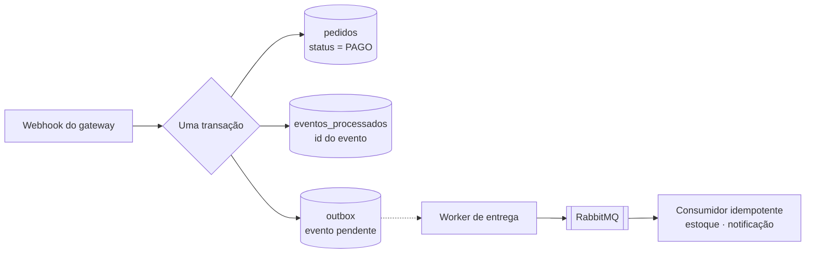

# API de Pedidos e Pagamentos

[](https://github.com/alcantarajv/api-pedidos/actions/workflows/ci.yml)
[](LICENSE)

API REST de pedidos com pagamento por gateway externo, construída em Java 21 com Spring Boot 4, PostgreSQL e RabbitMQ.

O que este projeto resolve não é o CRUD de produtos — é o que acontece quando a aplicação **depende de outro sistema**: o webhook do gateway que chega duas vezes, e a gravação no banco que precisa acontecer junto com a publicação na fila sem que exista transação entre os dois.

## No ar

**<https://api-pedidos-yi5d.onrender.com>**

[Demonstração ao vivo](https://api-pedidos-yi5d.onrender.com) · [Swagger UI](https://api-pedidos-yi5d.onrender.com/swagger-ui.html) · [Health](https://api-pedidos-yi5d.onrender.com/actuator/health) · [Catálogo](https://api-pedidos-yi5d.onrender.com/api/produtos)

A raiz traz uma página que executa a demonstração da idempotência **ao vivo**: ela cria uma conta, monta um pedido e reenvia **a mesma requisição com a mesma `Idempotency-Key`**, mostrando `201` na primeira e `200` na segunda — com o mesmo pedido e o estoque saindo uma vez só. É o argumento central do projeto rodando no navegador, sem precisar de terminal.

O serviço roda no plano gratuito do Render e hiberna quando ocioso: a primeira requisição depois de um tempo parado leva cerca de um minuto para responder — as seguintes são imediatas.

---

## Sumário

- [No ar](#no-ar)
- [Os dois problemas centrais](#os-dois-problemas-centrais)
  - [Problema 1 — O webhook que chega duas vezes](#problema-1--o-webhook-que-chega-duas-vezes)
  - [Problema 2 — Gravar no banco e publicar na fila](#problema-2--gravar-no-banco-e-publicar-na-fila)
- [Decisões técnicas](#decisões-técnicas)
  - [Registro completo das 84 decisões](docs/decisoes-tecnicas.md)
- [Modelo de domínio](#modelo-de-domínio)
- [Regras de negócio](#regras-de-negócio)
- [API](#api)
- [Como rodar](#como-rodar)
- [Testes](#testes)
- [Stack](#stack)
- [Roadmap](#roadmap)

---

## Os dois problemas centrais

### Problema 1 — O webhook que chega duas vezes

Quando um pagamento é aprovado, o gateway avisa a aplicação por webhook. Essa notificação **vai chegar mais de uma vez** — não é falha, é como gateways funcionam. A entrega é "pelo menos uma vez": se a resposta demora, se volta um 500, se a conexão cai depois do processamento mas antes da confirmação, o mesmo evento é reenviado.

A tentação é escrever isto:

```java
Pedido pedido = repositorio.buscar(evento.pedidoId());
pedido.marcarComoPago();          // <-- errado
estoque.baixar(pedido.itens());
email.enviarConfirmacao(pedido);
```

Na segunda entrega do mesmo evento, o estoque é baixado de novo e o cliente recebe o e-mail de novo.

A solução é registrar o identificador único do evento numa tabela com restrição de unicidade, **dentro da mesma transação** que aplica o efeito:

```
BEGIN
  INSERT INTO eventos_processados (id_externo) VALUES (?)   -- colide na segunda vez
  ... aplica o efeito ...
COMMIT
```

Ou as duas coisas acontecem, ou nenhuma. A segunda entrega colide na restrição, a transação inteira é desfeita e o evento é descartado com segurança — respondendo 200 para o gateway parar de reenviar.

O mesmo raciocínio vale na entrada da API: a criação de pedido aceita um cabeçalho `Idempotency-Key`, para que o cliente possa reenviar a requisição depois de um timeout sem criar dois pedidos.

### Problema 2 — Gravar no banco e publicar na fila

Confirmado o pagamento, a aplicação precisa fazer duas coisas: gravar a mudança no PostgreSQL e publicar um evento no RabbitMQ para que o estoque seja baixado e o cliente notificado.

São dois sistemas diferentes, e eles **não compartilham transação**. Qualquer ordem falha:

| Ordem | Falha possível | Resultado |
|---|---|---|
| Publicar, depois commitar | o commit falha | evento publicado sobre algo que não aconteceu |
| Commitar, depois publicar | a publicação falha | pedido pago e ninguém avisado |

A saída é o **padrão outbox**: a aplicação não publica na fila. Ela grava o evento numa tabela `outbox` na mesma transação que altera o pedido — uma transação, um banco, atômica. Um worker separado lê a tabela e publica, marcando o que já entregou.



Repare no que o outbox **não** promete: entrega exatamente uma vez. Se o worker publica e morre antes de marcar a linha como entregue, ele publica de novo na próxima rodada. O padrão troca "exatamente uma vez" — impossível entre sistemas que não compartilham transação — por "**pelo menos uma vez, com consumidor idempotente**".

É por isso que os dois problemas deste projeto são o mesmo problema visto de dois lados: o outbox só é seguro porque o outro lado sabe ignorar repetição.

Cada comportamento tem um teste que o comprova:

| Teste | O que prova |
|---|---|
| `WebhookIT.mesmoEventoDuasVezes` | três entregas do mesmo evento, um único efeito |
| `WebhookConcorrenteIT` | 12 entregas **simultâneas**, um único efeito |
| `OutboxFalhaNaPublicacaoIT` | broker fora do ar: o evento continua pendente e é entregue quando ele volta |
| `ConsumidoresIT.mensagemRepetida` | a mesma mensagem três vezes: um estoque baixado, um aviso enviado |
| `FluxoCompletoIT` | o caminho inteiro, do webhook à notificação |

---

## Decisões técnicas

O projeto registrou 84 decisões ao longo do desenvolvimento, cada uma com o motivo e a alternativa descartada. As que estão abaixo são as que definem o projeto; o registro completo, agrupado por tema, está em **[docs/decisoes-tecnicas.md](docs/decisoes-tecnicas.md)**.

### Idempotência e outbox

**Consulta prévia *e* índice único, não um ou outro.** A consulta resolve o caso comum — o cliente reenviou minutos depois — sem provocar erro no banco. O índice único fecha a janela entre consultar e gravar: duas requisições simultâneas passam pela consulta sem achar nada, e é o índice que derruba a segunda. Um teste com 12 threads e a mesma `Idempotency-Key` termina com todas recebendo o mesmo `id` e o banco com um único pedido.

**O tratamento do conflito vive fora da transação que falhou.** Quando o índice único é violado, o PostgreSQL recusa qualquer comando seguinte naquela transação (`current transaction is aborted`). Ler o pedido vencedor exige uma transação nova — por isso a criação está em `CriadorDePedido` (`@Transactional`) e o `try/catch` fica em `PedidoServico`, fora dela. Fazer o `catch` dentro do mesmo método transacional passa em banco em memória e falha no PostgreSQL.

**O worker marca como publicado só depois da confirmação do broker.** `convertAndSend` retorna assim que escreve no socket; o broker pode cair no milissegundo seguinte. O worker espera o *publisher confirm* antes de gravar `publicado_em`, e publica com `mandatory=true`, porque confirmação positiva significa "o broker aceitou", não "alguma fila recebeu" — sem isso, um binding faltando viraria evento perdido sem rastro.

**`FOR UPDATE SKIP LOCKED` para o worker escalar.** Com `SKIP LOCKED`, uma segunda instância da aplicação pega outro evento do outbox em vez de esperar pelo primeiro. Sem ele, mais instâncias formariam fila na mesma linha e o throughput de entrega não subiria.

### Concorrência

**Reserva de estoque com `SELECT ... FOR UPDATE`.** Ler "há 1 unidade" e gravar "agora há 0" tem uma janela no meio. O lock pessimista serializa apenas as reservas daquele produto. Lock otimista foi descartado porque disputa por estoque é conflito esperado, não raro — quase toda transação teria de ser repetida. E a `CHECK` de estoque não negativo não basta: removendo o lock, **8 das 12 threads** levaram a última unidade sem violar constraint nenhuma.

**Travar os produtos sempre na mesma ordem.** Os itens são ordenados por id antes da reserva. Sem isso, um pedido de `[A, B]` e outro de `[B, A]` travariam em ordens opostas e esperariam um pelo outro — deadlock.

### Domínio e integração

**A máquina de estados vive na entidade.** `pedido.marcarComoPago()` recusa a transição se o estado atual não permite. REST, consumidor de fila e job de expiração chegam todos à entidade; uma validação no controller protegeria só a porta da frente.

**`BigDecimal` com `NUMERIC`, nunca ponto flutuante.** `double` não representa `0,10` exatamente, e erro acumulado em valor de pedido aparece no extrato de alguém.

**A assinatura do webhook é conferida sobre os bytes crus, em tempo constante.** O corpo chega ao controller como `String`: desserializar e serializar de novo mudaria espaços e ordem de campos, e a assinatura HMAC deixaria de bater. A comparação usa `MessageDigest.isEqual`, porque `String.equals` sai no primeiro byte diferente e o tempo de resposta passaria a revelar a assinatura byte a byte.

**Timeouts explícitos, e falha do gateway é 502.** Sem timeout, um gateway que aceita a conexão e nunca responde esgota o pool do Tomcat e derruba a API inteira. Quando ele falha, a resposta é 502 e não 500: o defeito não é nosso, e com a chave de idempotência repetir é seguro.

### Escolha de ferramenta

**RabbitMQ em vez de Kafka.** O projeto precisa de fila de trabalho — "processe este evento uma vez" —, não de log reprocessável por vários consumidores. O RabbitMQ resolve com muito menos infraestrutura; Kafka traria partições, offsets e retenção que este domínio não usa.

## Modelo de domínio

| Entidade | Papel |
|---|---|
| `Usuario` | Credenciais (senha em hash BCrypt) e papel (`CLIENTE` ou `ADMIN`) |
| `Produto` | Nome, descrição, preço, estoque, ativo |
| `Pedido` | Cliente, itens, valor total, status e chave de idempotência |
| `ItemPedido` | Produto, quantidade e preço no momento da compra |
| `Pagamento` | Pedido, identificador externo do gateway, status e valor cobrado |
| `EventoProcessado` | Identificadores de eventos já consumidos — a garantia de idempotência |
| `OutboxEvento` | Evento pendente de publicação, com tentativas e data de entrega |

### Ciclo de vida do pedido

```
AGUARDANDO_PAGAMENTO ──> PAGO ──> SEPARANDO ──> ENVIADO ──> ENTREGUE
         │                 │
         └──> CANCELADO    └──> REEMBOLSADO
```

Transições inválidas são recusadas pelo domínio: um pedido `ENTREGUE` não volta para `PAGO`, um `CANCELADO` não avança.

## Regras de negócio

- Estoque é reservado na criação do pedido e confirmado no pagamento
- Pedido cancelado ou expirado devolve o estoque
- Pedido não pago expira após 30 minutos (configurável) e é cancelado automaticamente, devolvendo o estoque
- O preço do item é congelado na criação do pedido
- Um `CLIENTE` só enxerga os próprios pedidos; um `ADMIN` gerencia produtos e vê todos
- Webhook só é aceito com assinatura válida

---

## API

O que existe até aqui.

| Método | Rota | Acesso |
|---|---|---|
| `POST` | `/api/auth/registrar` | público (cria sempre `CLIENTE`) |
| `POST` | `/api/auth/login` | público |
| `GET` | `/api/auth/eu` | autenticado |
| `GET` | `/api/produtos` | público |
| `GET` | `/api/produtos/{id}` | público |
| `POST` | `/api/produtos` | `ADMIN` |
| `PUT` | `/api/produtos/{id}` | `ADMIN` |
| `PUT` | `/api/produtos/{id}/estoque` | `ADMIN` |
| `PUT` | `/api/produtos/{id}/situacao` | `ADMIN` |
| `POST` | `/api/pedidos` | autenticado (exige `Idempotency-Key`) |
| `GET` | `/api/pedidos` | autenticado (cliente vê os seus; admin vê todos) |
| `GET` | `/api/pedidos/{id}` | autenticado |
| `POST` | `/api/pedidos/{id}/cancelamento` | dono do pedido ou `ADMIN` |
| `POST` | `/api/pedidos/{id}/pagamento` | dono do pedido ou `ADMIN` |
| `GET` | `/api/pedidos/{id}/pagamento` | dono do pedido ou `ADMIN` |
| `POST` | `/api/webhooks/gateway` | público, autenticado por assinatura HMAC |
| `GET` | `/actuator/health` | público |
| `GET` | `/actuator/prometheus` | `ADMIN` |
| `GET` | `/swagger-ui.html` | público |
| `GET` | `/v3/api-docs` | público |

Autenticação por token no cabeçalho:

```http
Authorization: Bearer <token>
```

Criação de pedido — a chave torna o reenvio inofensivo:

```http
POST /api/pedidos
Authorization: Bearer <token>
Idempotency-Key: 7c9e6679-7425-40de-944b-e07fc1f90ae7

{"itens":[{"produtoId":1,"quantidade":3}]}
```

```
201 Created   na primeira vez
200 OK        em qualquer reenvio da mesma chave, com o mesmo pedido no corpo
```

A mesma leitura muda conforme quem pergunta — sem token, `estoqueReservado` e `estoqueTotal` não aparecem:

```jsonc
// GET /api/produtos/2            (público)
{"id":2,"nome":"Mouse Gamer","preco":199.90,"estoqueDisponivel":8,"ativo":true}

// GET /api/produtos/2            (token de ADMIN)
{"id":2,"nome":"Mouse Gamer","preco":199.90,"estoqueDisponivel":8,
 "estoqueReservado":0,"estoqueTotal":8,"ativo":true}
```

Erros saem em Problem Details (RFC 9457):

```http
HTTP/1.1 409 Conflict
Content-Type: application/problem+json

{
  "type": "https://api.pedidos.dev/erros/produto-duplicado",
  "title": "Conflito",
  "status": 409,
  "detail": "Ja existe um produto chamado 'teclado mecanico'",
  "instance": "/api/produtos",
  "ocorridoEm": "2026-09-21T18:31:39.618371500Z"
}
```

---

## Como rodar

Pré-requisitos: Java 21 e Docker. O Maven não precisa estar instalado — o wrapper (`mvnw`) baixa a versão certa.

```bash
cp .env.example .env
docker compose up -d
./mvnw spring-boot:run
```

A aplicação sobe em <http://localhost:8080> e o painel do RabbitMQ em <http://localhost:15672> (usuário e senha `pedidos`).

O `.env` precisa de um `JWT_SECRET` com pelo menos 32 caracteres — sem ele a aplicação **recusa subir**, dizendo qual propriedade falta. Defina também `ADMIN_INICIAL_EMAIL` e `ADMIN_INICIAL_SENHA` no primeiro boot: o registro público só cria `CLIENTE`, então esse é o único caminho para o primeiro administrador.

```bash
curl http://localhost:8080/actuator/health
```

O `health` agrega o estado do banco e do broker: se qualquer um dos dois estiver fora, a resposta é `DOWN` com o detalhe de qual falhou.

### Tudo em contêiner

```bash
docker compose --profile completo up --build
```

Sobe banco, broker e a aplicação empacotada. A aplicação só inicia depois de banco e broker responderem *healthy*, e ela própria só é considerada saudável quando alcança as duas.

O `.env` precisa ter `JWT_SECRET`, `STRIPE_API_KEY` e `STRIPE_WEBHOOK_SECRET` — sem eles o contêiner falha no boot dizendo qual falta.

### Sem Docker Compose

Pela IDE, a classe `TestPedidosApplication` sobe a aplicação com PostgreSQL e RabbitMQ descartáveis via Testcontainers — as duas dependências nascem com o processo e morrem junto, e cada execução começa com o banco limpo.

---

## Testes

**197 testes: 94 unitários e 103 de integração.**

```bash
./mvnw test
```

Só os unitários — regras de domínio, sem Docker, **5 segundos**. É o comando do dia a dia.

```bash
./mvnw verify
```

A suíte inteira, com PostgreSQL e RabbitMQ de verdade em contêiner: **~60 segundos**. Exige Docker ligado.

### Duas camadas, com propósitos diferentes

| | Unitários (`*Test`) | Integração (`*IT`) |
|---|---|---|
| Rodados por | Surefire | Failsafe |
| Dependem de | nada | PostgreSQL + RabbitMQ + WireMock |
| Provam | a regra de negócio | que as peças se encaixam |
| Exemplo | a matriz de 42 transições do pedido | 12 entregas simultâneas do mesmo webhook |

A separação existe para que rodar teste continue barato. Se cada execução custasse subir contêineres, o resultado prático seria rodar menos teste.

### Um contêiner por suíte, não por contexto

Esta suíte tem sete configurações de contexto diferentes — umas com MockMvc, outras com relógio ajustável, outra com o publicador substituído por um dublê. O Spring cacheia cada uma separadamente, e com o contêiner declarado por contexto isso subia **14 contêineres** numa execução.

Os contêineres agora são estáticos: sobem uma vez por JVM e são compartilhados. A suíte caiu de **1min35 para 60s**, e em CI — onde a imagem ainda precisa ser baixada — a diferença é maior.

O detalhe que falta em quase todo exemplo é o `@Bean(destroyMethod = "")`: sem ele, o Spring chama `stop()` ao fechar o primeiro contexto e os seguintes encontram um contêiner morto.

### O preço de compartilhar: isolamento é responsabilidade do teste

Banco e broker atravessam as classes de teste. Isso é deliberado — o ganho de tempo compensa —, mas cobra disciplina:

- Testes que precisam de contagem exata **limpam as tabelas** que usam (`TRUNCATE ... CASCADE` no `@BeforeEach`).
- Os demais trabalham com dados próprios: e-mails e nomes de produto com `UUID`, nunca ids fixos.
- Testes de fila **esvaziam** as filas que leem, e usam uma fila exclusiva (`pedidos.teste`) em vez de disputar mensagem com os consumidores de produção.
- Os jobs agendados ficam **desligados** no perfil de teste (intervalo de 1 hora). Um job disparando no meio de outro teste mudaria o estoque pelas costas dele.

Cada uma dessas regras nasceu de um teste que ficou instável. É o custo real de uma suíte que fala com infraestrutura — e é mais barato que a alternativa, que é não testar a infraestrutura.

### Por que não banco em memória

A garantia central do projeto depende de coisas que só o PostgreSQL tem: o erro de violação de unicidade que a idempotência traduz, o `FOR UPDATE SKIP LOCKED` do worker do outbox, os índices parciais. Testar contra H2 validaria um sistema diferente do que roda em produção — exatamente na parte que mais importa.

O mesmo para o RabbitMQ: o que precisa ser exercitado é a publicação falhar, a mensagem ficar no outbox, o consumidor receber o evento duas vezes, a mensagem ruim cair na fila de mortas. Um dublê responderia sempre com sucesso.

Cada execução também prova, de graça, que **as migrations aplicam do zero**: o contêiner nasce vazio e o Flyway roda as dez migrations antes do primeiro teste.

### Quando um teste passa, ele foi verificado

Todo mecanismo central deste projeto teve a proteção removida de propósito, para confirmar que o teste acusa:

| Proteção removida | O que o teste acusou |
|---|---|
| `SELECT ... FOR UPDATE` na reserva | **8 de 12** clientes levaram a mesma última unidade |
| `INSERT` do evento fora da transação | 11 de 12 entregas estouraram com transição inválida |
| Filtro de status na consulta de expiração | (nada — e por isso a consulta ganhou teste próprio) |

O terceiro caso é o mais instrutivo: o teste de comportamento **não** falhou, porque a máquina de estados recusava a transição de qualquer jeito. Teste de comportamento não cobre otimização.

---

## Stack

Java 21 · Spring Boot 4.1 · Spring Security · PostgreSQL 17 · RabbitMQ 4 · Flyway · JPA/Hibernate · JJWT · Stripe · Micrometer/Prometheus · springdoc-openapi 3 · JUnit 5 · AssertJ · Mockito · Testcontainers 2 · WireMock · Docker · GitHub Actions

---

## Roadmap

Todas as quinze etapas concluídas. Cada uma virou um commit, e a seção de
decisões técnicas acima foi alimentada a cada uma delas.


- [x] **Etapa 0** — Repositório: README, `.gitignore`, primeiro commit
- [x] **Etapa 1** — Scaffold Spring Boot + Docker Compose com PostgreSQL e RabbitMQ
- [x] **Etapa 2** — Catálogo: `Produto`, migrations, CRUD administrativo, controle de estoque
- [x] **Etapa 3** — Autenticação: `Usuario`, Spring Security, JWT, papéis `CLIENTE` e `ADMIN`
- [x] **Etapa 4** — Criação de pedido: itens, congelamento de preço, reserva de estoque, `Idempotency-Key`
- [x] **Etapa 5** — Máquina de estados do pedido, com transições inválidas recusadas pelo domínio
- [x] **Etapa 6** — Integração com o gateway: criação da cobrança e consulta de status
- [x] **Etapa 7** — **Webhook idempotente**: verificação de assinatura, tabela de eventos processados, teste de entrega duplicada
- [x] **Etapa 8** — **Padrão outbox**: tabela, publicação transacional, worker de entrega, teste de falha na publicação
- [x] **Etapa 9** — Consumidores dos eventos: baixa de estoque e notificação, ambos idempotentes
- [x] **Etapa 10** — Expiração automática de pedidos não pagos e devolução de estoque
- [x] **Etapa 11** — Observabilidade: métricas do Actuator, logs estruturados com id de correlação
- [x] **Etapa 12** — Testes de integração com Testcontainers (PostgreSQL + RabbitMQ) e WireMock
- [x] **Etapa 13** — Dockerfile, Compose completo, CI no GitHub Actions
- [x] **Etapa 14** — Documentação OpenAPI/Swagger
- [x] **Etapa 15** — Deploy público e README final com link ao vivo

---

## Projetos relacionados

Este é o terceiro de uma série, e cada um ataca um problema diferente de backend:

1. [encurtador-links](https://github.com/alcantarajv/encurtador-links) — **latência**: cache com Redis, rate limiting, processamento assíncrono
2. [reserva-quadras](https://github.com/alcantarajv/reserva-quadras) — **concorrência**: constraint de exclusão do PostgreSQL e teste multi-thread
3. **api-pedidos** — **consistência entre sistemas**: idempotência e padrão outbox

---

## Autor

**João Vitor Alcântara Corrêa**
[joaoalcantara.dev](https://joaoalcantara.dev) · [GitHub](https://github.com/alcantarajv) · [LinkedIn](https://linkedin.com/in/joaovalcantara)

---

## Licença

[MIT](LICENSE).
