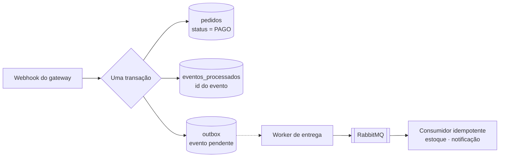

# API de Pedidos e Pagamentos

API REST de pedidos com pagamento por gateway externo, construída em Java 21 com Spring Boot 4, PostgreSQL e RabbitMQ.

O que este projeto resolve não é o CRUD de produtos — é o que acontece quando a aplicação **depende de outro sistema**: o webhook do gateway que chega duas vezes, e a gravação no banco que precisa acontecer junto com a publicação na fila sem que exista transação entre os dois.

> **Status:** em construção — Etapa 0 de 15. O [roadmap](#roadmap) mostra o que já está pronto e o que vem a seguir.

---

## Sumário

- [Os dois problemas centrais](#os-dois-problemas-centrais)
  - [Problema 1 — O webhook que chega duas vezes](#problema-1--o-webhook-que-chega-duas-vezes)
  - [Problema 2 — Gravar no banco e publicar na fila](#problema-2--gravar-no-banco-e-publicar-na-fila)
- [Decisões técnicas](#decisões-técnicas)
- [Modelo de domínio](#modelo-de-domínio)
- [Regras de negócio](#regras-de-negócio)
- [Stack](#stack)
- [Roadmap](#roadmap)

---

## Os dois problemas centrais

### Problema 1 — O webhook que chega duas vezes

Quando um pagamento é aprovado, o gateway avisa a aplicação por webhook. Essa notificação **vai chegar mais de uma vez** — não é falha, é como gateways funcionam. A entrega é "pelo menos uma vez": se a resposta demora, se volta um 500, se a conexão cai depois do processamento mas antes da confirmação, o mesmo evento é reenviado.

A tentação é escrever isto:

```java
Pedido pedido = repositorio.buscar(evento.pedidoId());
pedido.marcarComoPago();          // <-- errado
estoque.baixar(pedido.itens());
email.enviarConfirmacao(pedido);
```

Na segunda entrega do mesmo evento, o estoque é baixado de novo e o cliente recebe o e-mail de novo.

A solução é registrar o identificador único do evento numa tabela com restrição de unicidade, **dentro da mesma transação** que aplica o efeito:

```
BEGIN
  INSERT INTO eventos_processados (id_externo) VALUES (?)   -- colide na segunda vez
  ... aplica o efeito ...
COMMIT
```

Ou as duas coisas acontecem, ou nenhuma. A segunda entrega colide na restrição, a transação inteira é desfeita e o evento é descartado com segurança — respondendo 200 para o gateway parar de reenviar.

O mesmo raciocínio vale na entrada da API: a criação de pedido aceita um cabeçalho `Idempotency-Key`, para que o cliente possa reenviar a requisição depois de um timeout sem criar dois pedidos.

### Problema 2 — Gravar no banco e publicar na fila

Confirmado o pagamento, a aplicação precisa fazer duas coisas: gravar a mudança no PostgreSQL e publicar um evento no RabbitMQ para que o estoque seja baixado e o cliente notificado.

São dois sistemas diferentes, e eles **não compartilham transação**. Qualquer ordem falha:

| Ordem | Falha possível | Resultado |
|---|---|---|
| Publicar, depois commitar | o commit falha | evento publicado sobre algo que não aconteceu |
| Commitar, depois publicar | a publicação falha | pedido pago e ninguém avisado |

A saída é o **padrão outbox**: a aplicação não publica na fila. Ela grava o evento numa tabela `outbox` na mesma transação que altera o pedido — uma transação, um banco, atômica. Um worker separado lê a tabela e publica, marcando o que já entregou.



Repare no que o outbox **não** promete: entrega exatamente uma vez. Se o worker publica e morre antes de marcar a linha como entregue, ele publica de novo na próxima rodada. O padrão troca "exatamente uma vez" — impossível entre sistemas que não compartilham transação — por "**pelo menos uma vez, com consumidor idempotente**".

É por isso que os dois problemas deste projeto são o mesmo problema visto de dois lados: o outbox só é seguro porque o outro lado sabe ignorar repetição.

Cada comportamento terá um teste que o comprova: um que entrega o mesmo webhook duas vezes e verifica um único efeito, e outro que simula falha na publicação e verifica que o evento continua no outbox para nova tentativa.

---

## Decisões técnicas

Esta seção cresce a cada etapa. Cada entrada registra a escolha, o motivo e a alternativa descartada.

### RabbitMQ em vez de Kafka

O projeto precisa de **fila de trabalho** — "processe este evento uma vez" — não de log de eventos reprocessável por vários consumidores independentes. O RabbitMQ resolve isso com muito menos infraestrutura e sobe em um contêiner. Kafka traria partições, offsets e retenção que este domínio não usa. Escolher a ferramenta menor quando ela basta é uma decisão melhor de defender do que usar a maior por ser impressionante.

### Stripe em modo de teste

Ambiente de testes sem burocracia, documentação boa e uma CLI (`stripe listen`) que encaminha webhooks para a máquina local — o que permite desenvolver a parte mais importante do projeto sem expor um endpoint na internet. Alternativa considerada: Mercado Pago, mais reconhecível para recrutador brasileiro, e o plano B caso o sandbox do Stripe crie atrito.

### Sem Lombok

`record` para DTOs e código explícito no resto. Getters e construtores gerados por anotação escondem exatamente aquilo que uma entrevista pede para explicar, e o custo de escrevê-los é baixo perto de depender de um processador de anotações no build.

### `BigDecimal` com `NUMERIC`, nunca ponto flutuante

`double` não representa `0,10` exatamente. Somar centavos em ponto flutuante acumula erro, e erro em valor de pedido é defeito que aparece no extrato de alguém. `BigDecimal` com escala definida na aplicação, `NUMERIC` na coluna.

### O preço do item é congelado no pedido

`ItemPedido` guarda o preço praticado no momento da compra. Ler o preço atual do `Produto` ao exibir um pedido antigo faria o histórico mudar sozinho a cada reajuste do catálogo.

### A máquina de estados vive na entidade

`pedido.marcarComoPago()` recusa a transição se o estado atual não permite. A regra não fica no controller nem no serviço: qualquer caminho que chegue à entidade — REST, consumidor de fila, job de expiração — precisa obedecer à mesma restrição, e só a entidade está em todos esses caminhos.

### O `Clock` é um bean injetado

Nenhuma regra chama `Instant.now()` diretamente. "Pedido não pago expira em N minutos" depende de tempo, e regra que depende de tempo só é testável se o tempo for controlável. Nos testes o bean vira `Clock.fixed(...)`.

### Nenhum segredo no repositório

Chave da API do gateway e segredo de assinatura do webhook entram só por variável de ambiente. Este projeto lida com pagamento: a assinatura do webhook é o que impede qualquer pessoa na internet de confirmar pedidos de graça, e vazá-la no Git anularia a proteção inteira.

---

## Modelo de domínio

| Entidade | Papel |
|---|---|
| `Usuario` | Credenciais e papel (`CLIENTE` ou `ADMIN`) |
| `Produto` | Nome, descrição, preço, estoque, ativo |
| `Pedido` | Cliente, itens, valor total, status, chave de idempotência |
| `ItemPedido` | Produto, quantidade e preço no momento da compra |
| `Pagamento` | Pedido, identificador externo do gateway, status, valor |
| `EventoProcessado` | Identificadores de eventos já consumidos |
| `OutboxEvento` | Evento pendente de publicação, com tentativas e data de entrega |

### Ciclo de vida do pedido

```
AGUARDANDO_PAGAMENTO ──> PAGO ──> SEPARANDO ──> ENVIADO ──> ENTREGUE
         │                 │
         └──> CANCELADO    └──> REEMBOLSADO
```

Transições inválidas são recusadas pelo domínio: um pedido `ENTREGUE` não volta para `PAGO`, um `CANCELADO` não avança.

## Regras de negócio

- Estoque é reservado na criação do pedido e confirmado no pagamento
- Pedido cancelado ou expirado devolve o estoque
- Pedido não pago expira após um prazo configurável e é cancelado automaticamente
- O preço do item é congelado na criação do pedido
- Um `CLIENTE` só enxerga os próprios pedidos; um `ADMIN` gerencia produtos e vê todos
- Webhook só é aceito com assinatura válida

---

## Stack

Java 21 · Spring Boot 4 · Spring Security · PostgreSQL · RabbitMQ · Flyway · JPA/Hibernate · Stripe · JUnit 5 · AssertJ · Testcontainers · WireMock · Docker · GitHub Actions

---

## Roadmap

- [x] **Etapa 0** — Repositório: README, `.gitignore`, primeiro commit
- [ ] **Etapa 1** — Scaffold Spring Boot + Docker Compose com PostgreSQL e RabbitMQ
- [ ] **Etapa 2** — Catálogo: `Produto`, migrations, CRUD administrativo, controle de estoque
- [ ] **Etapa 3** — Autenticação: `Usuario`, Spring Security, JWT, papéis `CLIENTE` e `ADMIN`
- [ ] **Etapa 4** — Criação de pedido: itens, congelamento de preço, reserva de estoque, `Idempotency-Key`
- [ ] **Etapa 5** — Máquina de estados do pedido, com transições inválidas recusadas pelo domínio
- [ ] **Etapa 6** — Integração com o gateway: criação da cobrança e consulta de status
- [ ] **Etapa 7** — **Webhook idempotente**: verificação de assinatura, tabela de eventos processados, teste de entrega duplicada
- [ ] **Etapa 8** — **Padrão outbox**: tabela, publicação transacional, worker de entrega, teste de falha na publicação
- [ ] **Etapa 9** — Consumidores dos eventos: baixa de estoque e notificação, ambos idempotentes
- [ ] **Etapa 10** — Expiração automática de pedidos não pagos e devolução de estoque
- [ ] **Etapa 11** — Observabilidade: métricas do Actuator, logs estruturados com id de correlação
- [ ] **Etapa 12** — Testes de integração com Testcontainers (PostgreSQL + RabbitMQ) e WireMock
- [ ] **Etapa 13** — Dockerfile, Compose completo, CI no GitHub Actions
- [ ] **Etapa 14** — Documentação OpenAPI/Swagger
- [ ] **Etapa 15** — Deploy público e README final com link ao vivo

---

## Projetos relacionados

Este é o terceiro de uma série, e cada um ataca um problema diferente de backend:

1. [encurtador-links](https://github.com/alcantarajv/encurtador-links) — **latência**: cache com Redis, rate limiting, processamento assíncrono
2. [reserva-quadras](https://github.com/alcantarajv/reserva-quadras) — **concorrência**: constraint de exclusão do PostgreSQL e teste multi-thread
3. **api-pedidos** — **consistência entre sistemas**: idempotência e padrão outbox

---

## Autor

**João Vitor Alcântara Corrêa**
[GitHub](https://github.com/alcantarajv) · [LinkedIn](https://linkedin.com/in/joaovalcantara)
